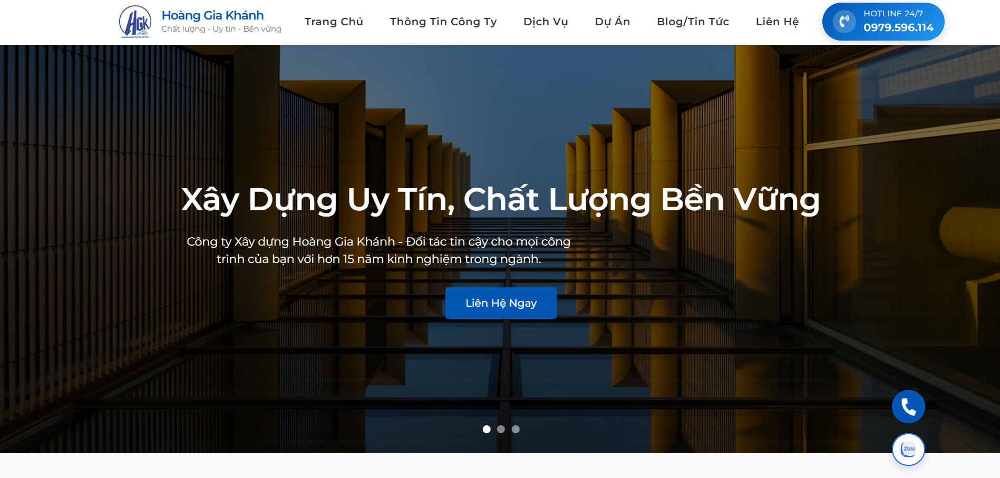
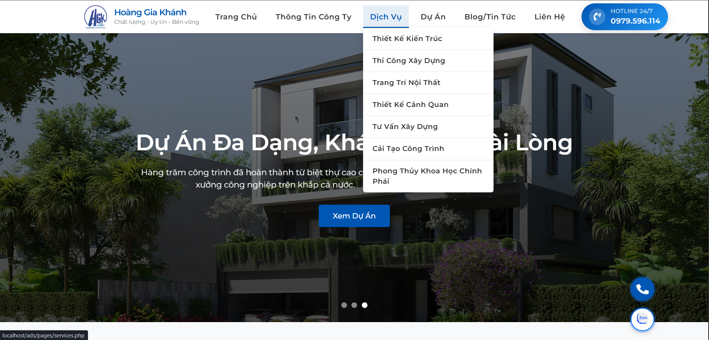
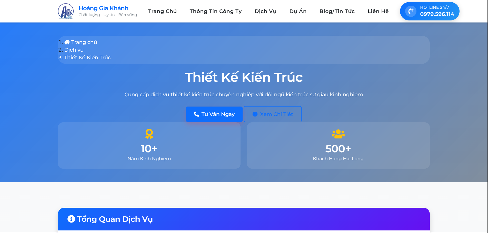
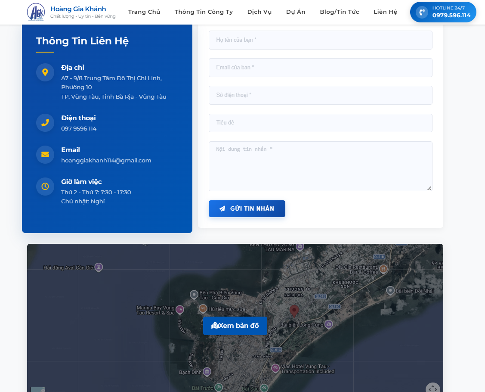

# 🏗️ Construction Company Website

## 🚀 Overview
This is a real-world website developed for a construction company.

## 🛠️ Technologies Used
- PHP (Backend)
- MySQL (Database)
- HTML, CSS, JavaScript
- Apache (XAMPP)

## ✨ Features
- Company introduction
- Service pages
- Project showcase
- Contact form

## 💡 My Role
- Developed backend using PHP
- Designed frontend layout
- Connected database
- Built dynamic content

## 📸 Screenshots
Here are some main interfaces of the website:

### 🏠 Homepage

### 📋 Navigation Menu

### 🧱 Services Section

### 📞 Contact / CTA

## ⚙️ Setup Instructions
1. Install XAMPP
2. Move project to htdocs
3. Start Apache & MySQL
4. Open http://localhost/ads
